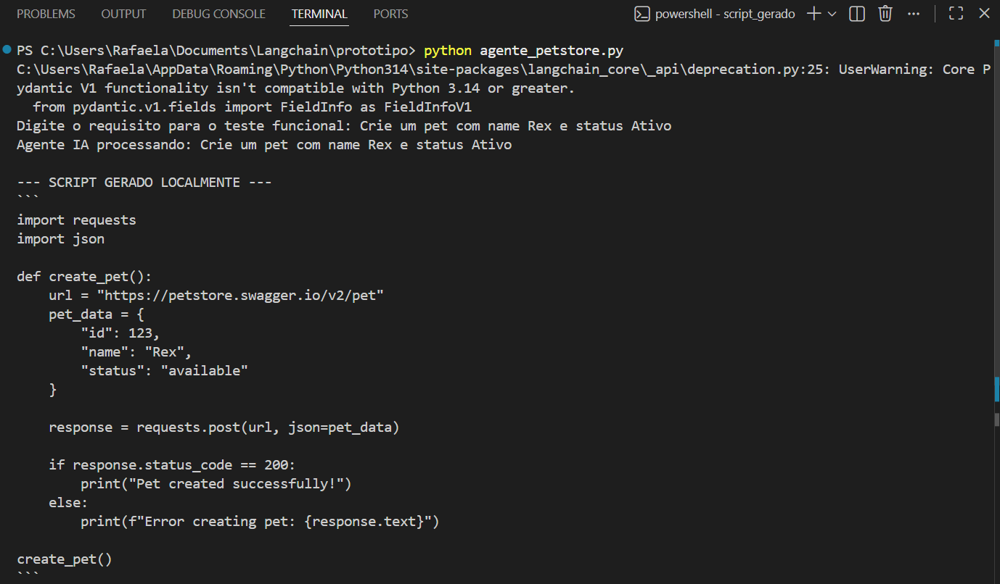
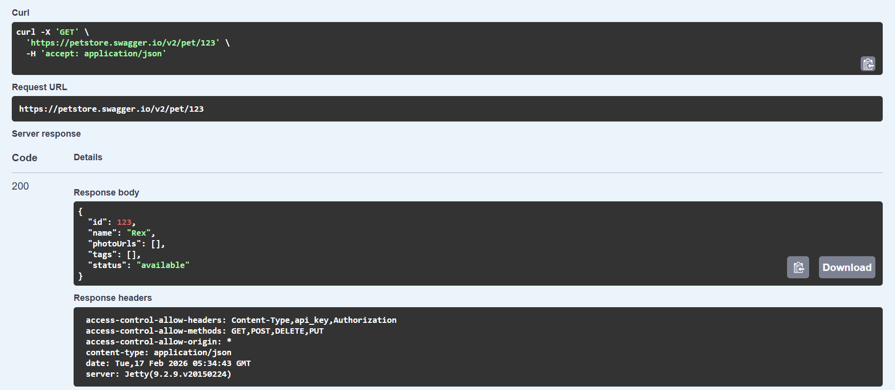

# Automação de Testes de API via LLM Local

Este repositório contém um projeto desenvolvido para fins de **portfólio e desenvolvimento de aprendizado prático** em Engenharia de IA e Qualidade de Software (QA).

É uma implementação de um agente de IA que automatiza a escrita de scripts de teste funcional. A solução utiliza um pipeline orquestrado pelo **LangChain** e executado localmente via **Ollama**, garantindo privacidade de dados e execução sem custos de API em nuvem.

O objetivo principal foi aplicar conhecimentos em IA Generativa para converter requisitos funcionais descritos em linguagem natural diretamente em código Python executável, validado contra contratos de API (Swagger/OpenAPI).

## Arquitetura e Stack Tecnológica

O sistema opera através da injeção de contexto técnico (endpoints, métodos HTTP e schemas JSON) no prompt do modelo, restringindo a alucinação e garantindo código funcional.

* **Linguagem:** Python 3.14
* **Orquestrador:** LangChain (Gerenciamento de Templates e Chain de Execução)
* **LLM Engine:** Ollama (Inferência Local)
* **Modelo:** Llama 3 (8B Parameters - Quantized)
* **Integração:** Biblioteca `requests` para chamadas HTTP
* **Alvo de Teste:** [Petstore Swagger API (v2)](https://petstore.swagger.io/) (É um servidor de exemplo para uma loja de animais.)

## Configuração do Ambiente

### 1. Motor de IA (Ollama)
O projeto depende do Ollama rodando em background para servir o modelo via localhost.

1.  Instale o [Ollama](https://ollama.com).
2.  No terminal, realize o download do modelo Llama 3:
    ```bash
    ollama pull llama3
    ```

### 2. Instalação de Dependências
Recomenda-se o uso de ambiente virtual (venv).

```bash
pip install langchain-ollama langchain-core requests
```

## Execução e Fluxo de Trabalho
O script principal (agente_petstore.py) inicia um CLI onde o cenário de teste é inserido.

* **Entrada:** Descrição do cenário (ex: "Crie um pet chamado Rex...").

* **Processamento:** O agente analisa a intenção e mapeia para o endpoint correto (POST /pet).

* **Saída:** O script Python é gerado e salvo na pasta /script_gerado.

Abaixo, o log de execução demonstrando o processamento do requisito "Crie um pet com name Rex e status Ativo" e a geração imediata do código:


## Validação e Prova de Conceito

Para garantir a confiabilidade do código gerado pela IA, foi realizado um teste de integração ponta a ponta:

### Execução do Script Gerado: O arquivo criado pela IA foi executado, realizando um POST na API da Petstore.

### Validação no Swagger: Foi realizada uma consulta manual (GET /pet/123) para confirmar a persistência dos dados, como consta na imagem abaixo.



### Resultado: O servidor retornou Status 200 OK e o corpo da resposta confirmou o ID 123 e o nome Rex, validando a eficácia do agente.

📂 Estrutura do Projeto
Plaintext
.
├── agente_petstore.py        # Script principal do Agente (LangChain Pipeline)
├── script_gerado/            # Diretório de saída dos scripts de teste
│   └── teste_rex.py          # Script gerado automaticamente pela IA
│   └── consulta_swagger.png  # Imagem para verificação do sucesso do script teste
│   └── terminal.png          # Imagem do terminal após execução
└── README.md                 # Documentação do projeto

**⚠️ Aviso
Este é um projeto de cunho educacional e demonstrativo, criado para consolidar conhecimentos em orquestração de LLMs e automação de testes. Não se trata de um produto final para produção.**

Desenvolvido por Rafaela Peçanha como parte de portfólio pessoal em Engenharia de QA e IA Generativa.
